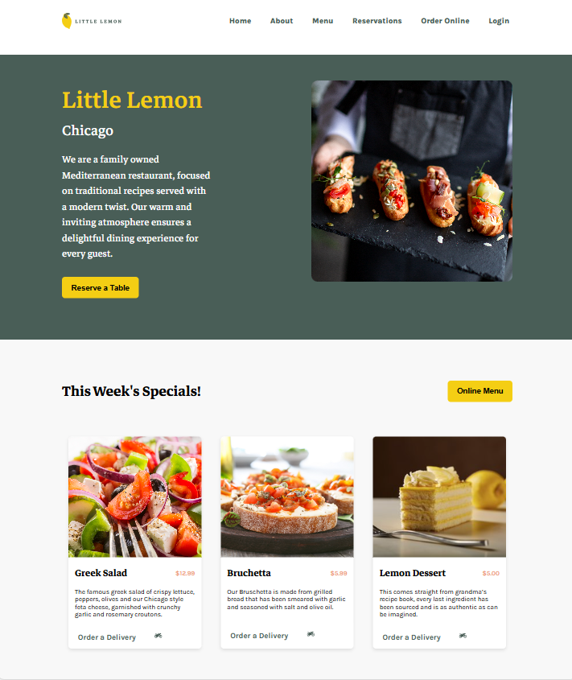

 My Coursera Frontend Capstone Project

 # # Little-Lemon-Restaurant -  My Coursera Frontend Capstone Project

This is a solution to the [Little-Lemon-Restaurant](https://www.coursera.org/learn/meta-front-end-developer-capstone/peer/KORh6/booking-a-table-on-the-little-lemon-website). Coursera help you improve your coding skills by building realistic projects. 

## Table of contents

- [Overview](#overview)
  - [The challenge](#the-challenge)
  - [Screenshot](#screenshot)
  - [Links](#links)
- [My process](#my-process)
  - [Built with](#built-with)
  - [What I learned](#what-i-learned)
  - [Continued development](#continued-development)
  - [Useful resources](#useful-resources)
- [Author](#author)
- [Acknowledgments](#acknowledgments)

**Note: Delete this note and update the table of contents based on what sections you keep.**

## Overview

### The challenge

Users should be able to:

- View the optimal layout for the site depending on their device's screen size

### Screenshot

### Links

- Solution URL: [https://github.com/manjubhaskar02/Little-Lemon-Restaurant](https://github.com/manjubhaskar02/Little-Lemon-Restaurant)
- Live Site URL: 

## My process

### Built with

- Semantic HTML5 markup
- CSS custom properties
- Tailwind CSS
### What I learned

in this section I learned a little on using  grids in taiwind css, using order, col-span, row-span and more.

### Continued development

Want to focus on grid sections more.
### Useful resources

Taiwind CSS
## Author

## Acknowledgments

I always want to thank my hubby, Safaldas who always push me to do the challenges and my mentor Sneha .

